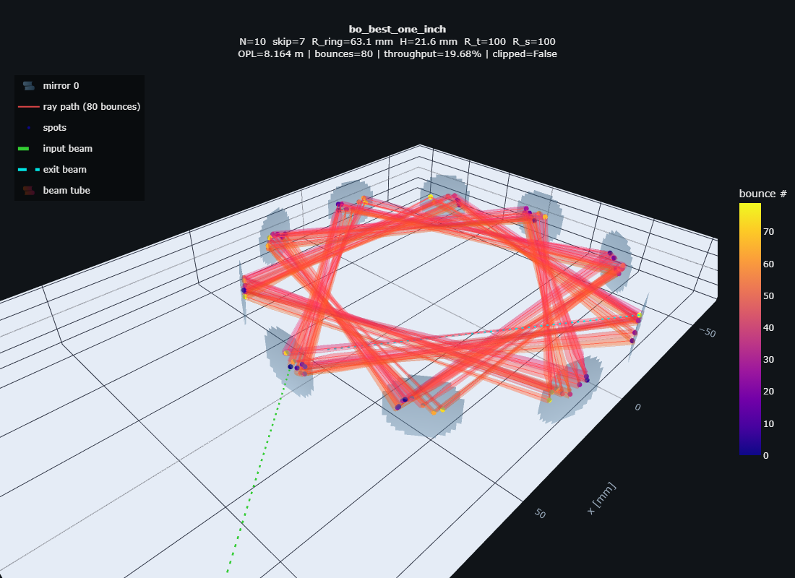
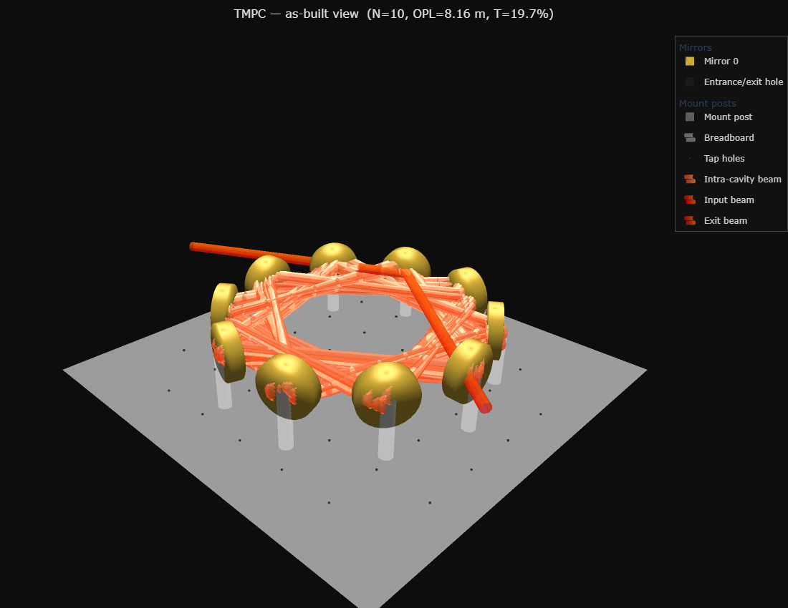
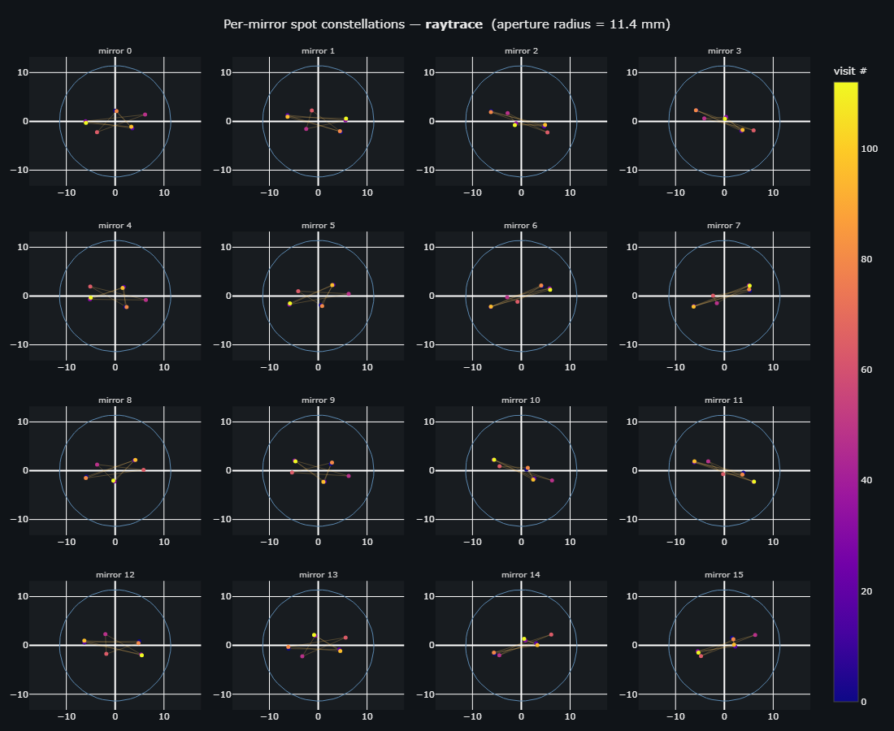

# Toroidal Multipass Cell (TMPC) — design, simulation & tolerancing

Research code for **Toroidal Multipass Cells** used in laser absorption
spectroscopy of methane (CH₄) at **1.654 µm**. A TMPC folds tens of metres of
optical absorption path into a palm-sized cell by bouncing the laser around a
ring of curved mirrors — the more path, the more sensitive the gas sensor.

The current, definitive model lives in **[`_CURRENT/tmpc_platform_v5/`](_CURRENT/tmpc_platform_v5/)**.
It simulates the real 3-D ray path and astigmatic Gaussian beam, estimates
**build tolerances**, optimises designs, validates against
[Optiland](https://github.com/HarrisonKramer/optiland), and renders everything
in 3-D.

<p align="center">
  
  
</p>

*Left: the true ray-traced path with the beam rendered as a tube. Right: the
same cell as an "as-built" assembly — gold 1" mirrors, mounts, breadboard, and
the laser bouncing through it.*

---

## What it does

- **Physics** — exact 3-D ray tracing on toroidal mirrors; realistic
  **astigmatic** Gaussian beam (`f_tan = R·cosθ/2`, `f_sag = R/(2cosθ)`, M²);
  two topologies (Herriott ring + Tuzson/Graf up-down spiral); loss budget;
  per-plane stability; spot-pattern diagnostics.
- **Tolerances** — Monte-Carlo yield, one-at-a-time sensitivity, and an RSS
  tolerance-budget allocator that tells you how precisely to build the cell.
- **Optimisation** — random + Bayesian search, dependency-free Pareto fronts,
  Thorlabs-catalogue-constrained sampling, a RandomForest surrogate.
- **Visualisation** — interactive 3-D cell views, per-mirror spot
  constellations, and photoreal "as-built" renders.
- **Validation** — analytic checks (AOI = π/2 − π/N) and an Optiland
  cross-check that reproduces the ray-tracer to ~0 µm.

See the **[figure gallery](_CURRENT/tmpc_platform_v5/examples/README.md)** for the full
set of rendered outputs.

<p align="center">
  
</p>

*Per-mirror spot pattern for a toroidal (R_t ≠ R_s) design — the astigmatic
Lissajous footprints on each mirror face.*

---

## Quick start

```bash
# the current model lives in _CURRENT/ — run from there so `-m tmpc_platform_v5`
# resolves. the project virtualenv (numpy, scipy, matplotlib, plotly,
# scikit-learn, scikit-optimize, optiland) sits one level up at ../.venv
cd _CURRENT
PY=../.venv/Scripts/python.exe

# one design, full physics report
$PY -m tmpc_platform_v5 simulate --preset bo_best_one_inch

# tolerance study (Monte-Carlo + sensitivity + RSS budget + plots)
$PY -m tmpc_platform_v5 tolerance --preset bo_best_one_inch --out-dir results/tol

# interactive 3-D view + spot constellations (standalone HTML)
$PY -m tmpc_platform_v5 visualize --preset bo_best_one_inch --out-dir results/viz

# photoreal "as-built" render
$PY -m tmpc_platform_v5 render --preset bo_best_one_inch --out results/exp.html

# physics validation, multi-objective Pareto, named designs
$PY -m tmpc_platform_v5 validate --preset bo_best_one_inch
$PY -m tmpc_platform_v5 pareto   --n 512
$PY -m tmpc_platform_v5 presets
```

Full documentation, the Python API, and the module map are in
**[`_CURRENT/tmpc_platform_v5/README.md`](_CURRENT/tmpc_platform_v5/README.md)**.

---

## Repository layout

| Path | What it is |
|---|---|
| **`_CURRENT/`** | **Everything current** — the definitive model, gathered for easy access |
| **`_CURRENT/tmpc_platform_v5/`** | **Current model** — physics + tolerances + 3-D viz + CLI + tests |
| `_CURRENT/tmpc_platform_v5/examples/` | Regenerable figure gallery |
| `tmpc_platform_v4/`, `tmpc_platform_v2/`, `tmpc_platform/` | Earlier iterations (kept for reference) |
| `toroidal-cell/` | Original analytic-spiral lineage + Optiland validation |
| `test.py` | Standalone Optiland cross-validation of the original tracer |
| `.venv/`, `requirements.txt` | Shared Python runtime (numpy/scipy/plotly/sklearn/optiland …) |

> IP note: per the IITD-Abu Dhabi / Aston joint brief, all IP belongs to Aston.
> Internal use only.
