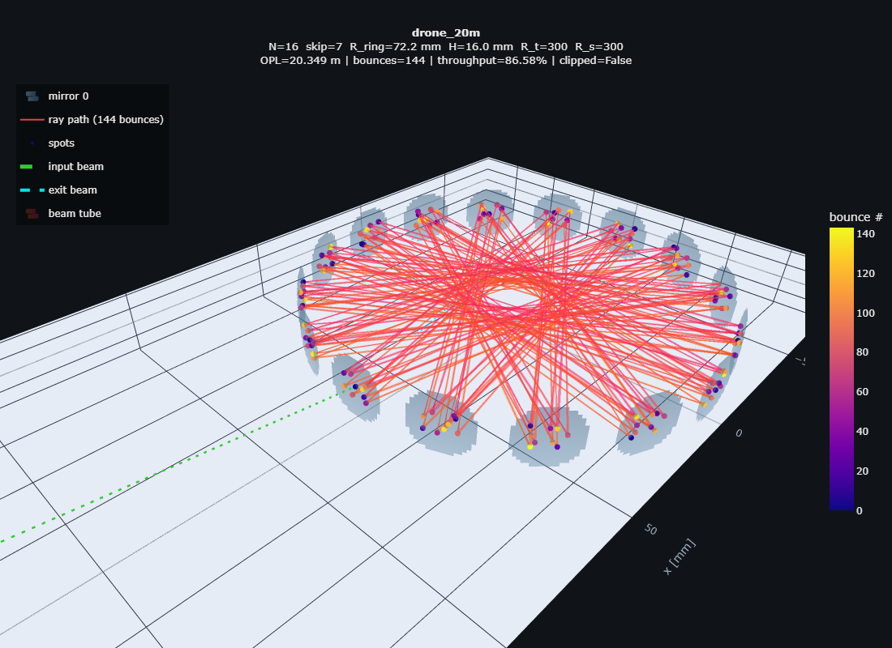
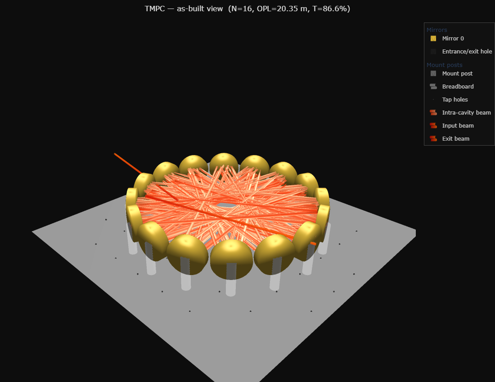
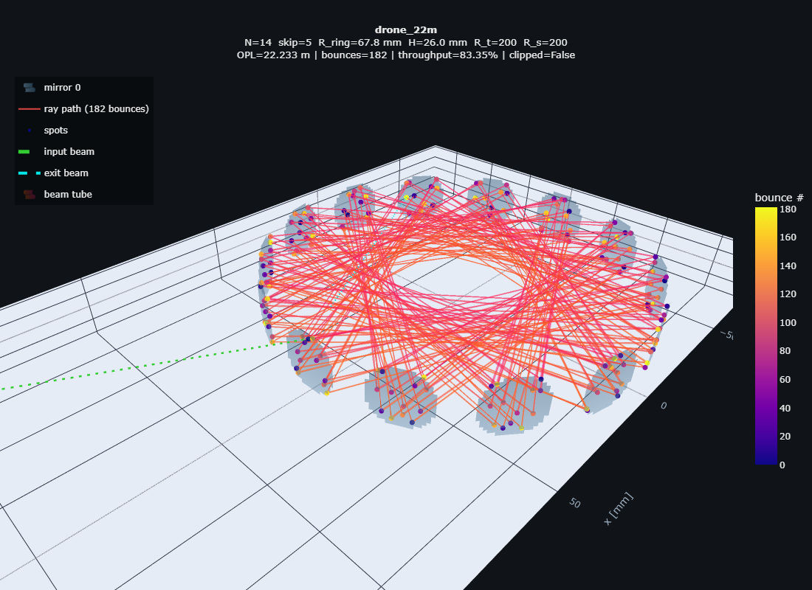
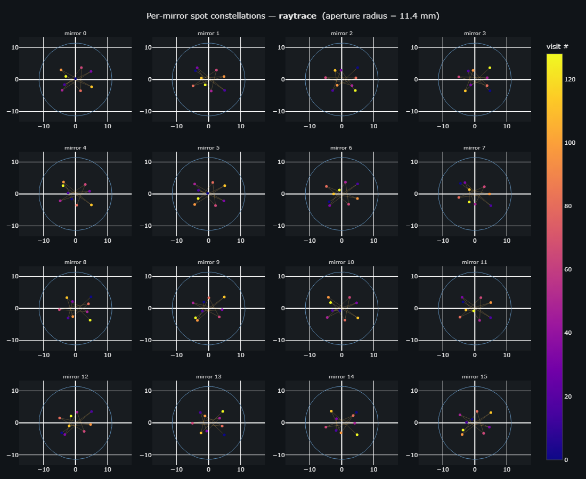
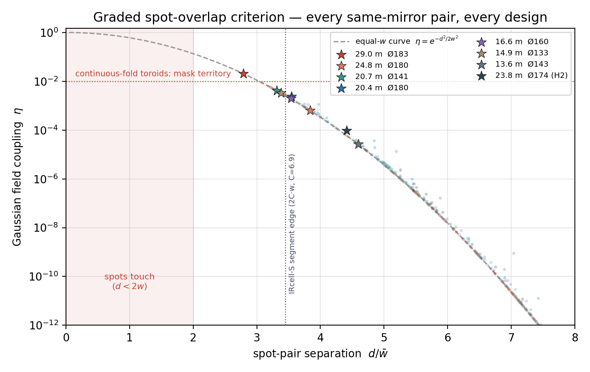
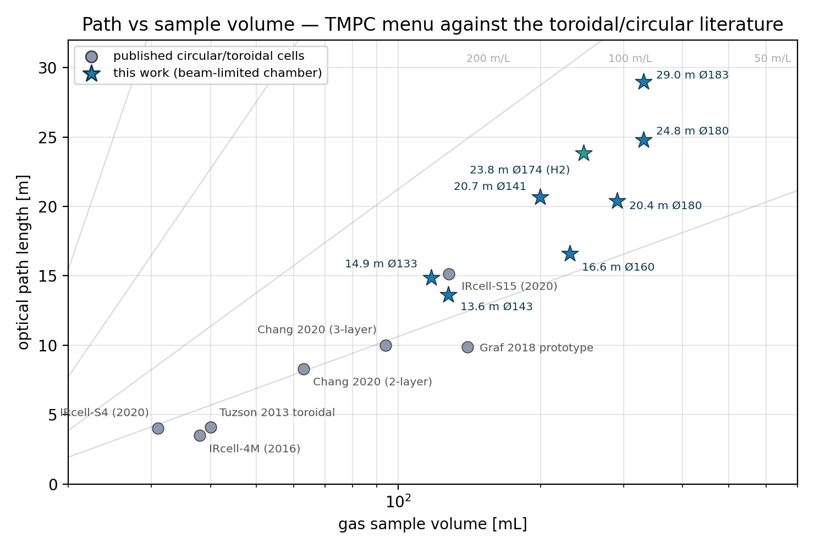
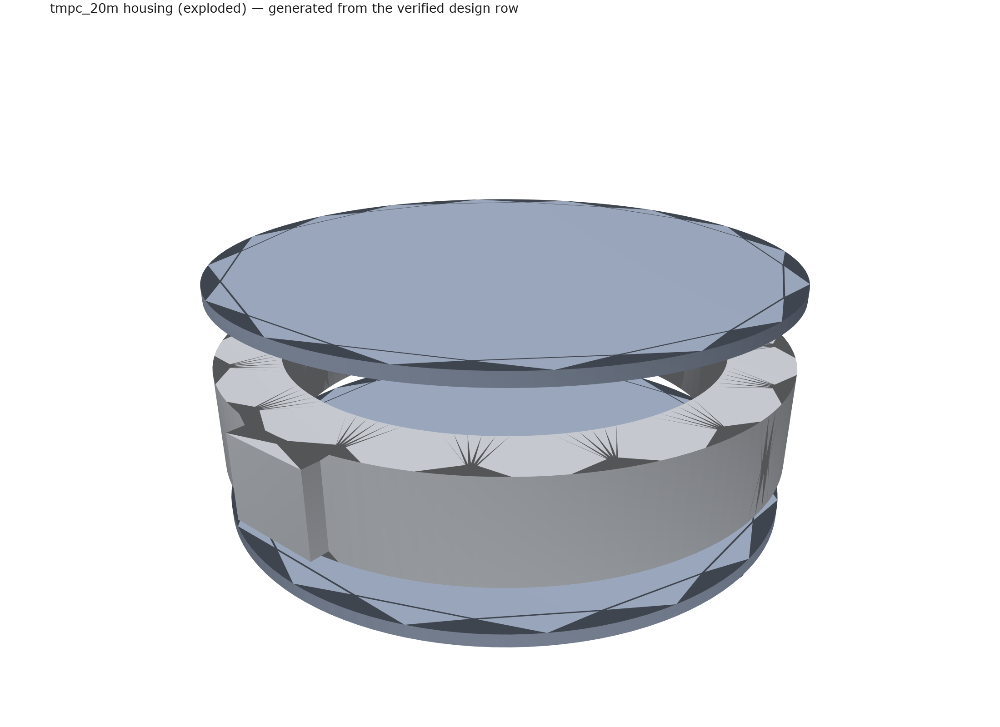
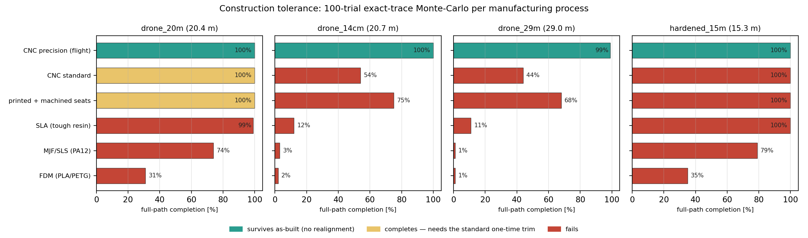

# Drone TMPC design suite — verified 1″-mirror cells, Ø140–180 mm, 13.6–24.8 m OPL

Design brief (2026-07-02): a drone-mountable toroidal multipass cell for CH₄
TDLAS at 1654 nm — target ~20 m OPL, assembly diameter safely under 190 mm
(smaller better), **N = 8–16** Thorlabs 1″ protected-gold concave mirrors
(CM254-xxx-M01), entrance-hole radius 1.3 mm, 1.3 mm collimated input beam,
reflectivity assumed 0.984–0.985 (throughput reported parametrically in R).

Every design below is verified by the exact 3-D ray tracer
(`tmpc_platform_v5`) against the full physical-check matrix: exit through the
entrance hole, no early hole leakage, 1/e² beam edge inside every clear
aperture, no spot overlap anywhere (fringe safety), per-plane astigmatic
stability, mirror packing, and the envelope cap. Optiland cross-validation
reproduces the traced path to 0.000 µm RMS.

<p align="center">
  
  
</p>

*Left: the traced light path of `drone_20m` — 144 chords between 16 catalog
mirrors, input (green) and exit beams through the hole in mirror 0.
Right: the same cell rendered as built. Interactive versions:
[cell3d.html](designs/figures/drone_20m_cell3d.html),
[experiment.html](designs/figures/drone_20m_experiment.html).*

<p align="center">
  
  
</p>

*The longer-path corners: `drone_25m` (left — 176 chords, 24.77 m, 11 spots
per mirror in the same 180 mm envelope) and the new `drone_22m` (right —
182 chords, 22.25 m in 172 mm). At R = 0.999 these extra passes cost only
~3 % of signal.*

<p align="center">
  
</p>

*The 9-spot constellation each mirror carries — same Lissajous, different
phase origin per mirror; worst pair distance is a verified check.*

## The tolerance-tiered menu

Transmission at **R = 0.999** (the project's mirrors); the hole is lossless
so **T(R) = R^(chords−1) exactly** for any other coating. Every design
passes the full check matrix in the exact trace **and** a 100-trial
Monte-Carlo at the stated build grade with physical criteria: full path
completes in every trial, spots never merge, intermediate spots keep
clearing the hole, and the exit still leaves the 1.3 mm hole with **no
realignment** ([robust_menu.csv](designs/robust_menu.csv) /
[flight](designs/robust_menu_flight.csv)).

**Tier 1 — standard lab build** (kinematic mounts, 0.5 mrad tilt class):

| design | mirrors | chords | **OPL** | T @0.999 | envelope | preset |
|---|---|---|---|---|---|---|
| standard-build corner | 16 × CM254-150 (ROC 300) | 144 | 20.38 m | 86.7 % | Ø180 | `drone_20m` |

**Tier 2 — precision (flight-grade) build** (glued/welded, 0.1 mrad tilt
class — the drone-vibration spec anyway):

| design | mirrors | chords | **OPL** | T @0.999 | envelope | preset / spec |
|---|---|---|---|---|---|---|
| **max OPL** | 12 × CM254-750 (ROC 1500) | 204 | **28.99 m** | 76.6 % | Ø183 | `drone_29m` · [spec](designs/spec_D190_29m.md) |
| long | 16 × CM254-200 (ROC 400) | 176 | **24.77 m** | 83.9 % | Ø180 | `drone_25m` (walk-budget variant) |
| **compact star** | 12 × CM254-500 (ROC 1000) | 204 | **20.66 m** | 81.6 % | **Ø141** | `drone_14cm` · [spec](designs/spec_D150_14cm.md) |
| balanced | 13 × CM254-150 (ROC 300) | 143 | 16.60 m | 86.8 % | Ø160 | [spec](designs/spec_D170_maxT.md) |
| small | 10 × CM254-150 (ROC 300) | 190 | 14.85 m | 82.8 % | Ø133 | — |
| small max-T | 12 × CM254-250 (ROC 500) | 132 | 13.64 m | 87.7 % | Ø143 | [spec](designs/spec_D150_maxOPL.md) |

Robustness-by-design findings (search v8): demanding 0.55 mm clearances
during the search hardened the surviving designs (drone_20m's worst-case
p05 separation grew 0.94 → 1.23 mm; the 24.8 m design was **promoted**
into this tier), while the 1/sin θ error-amplification gate was
empirically falsified — the near-planar long-ROC family it would exclude
is exactly what wins here. Pattern walk grows ~√chords with build error,
so the standard-tolerance ceiling sits near 145 chords; a drone needs the
glued/welded construction for vibration regardless, making this tier the
operative drone menu.

**Tier 3 — active alignment required** (feasible nominal designs whose
dense patterns exceed passive build tolerances): **26.7 m/Ø157** (12 ×
CM254-075, 228 chords — new, v9 deep search), 24.8 m/Ø180 (`drone_25m`),
22.0 m/Ø155, 22.3 m/Ø172 (`drone_22m`), 20.6 m/Ø159 (`drone_16cm`), up
to **38.6 m/Ø169** (14 × CM254-100, 322 chords, 72.5 %) — the geometric
ceiling of the architecture; buildable only with in-situ trim (ring
temperature + launch piezo) or sub-0.1 mrad machining. A second, deeper
search pass (walk-budget 0.55, top-200/refine-80) found **no additions
to the flight-robust tier** — the Tier-2 menu is the converged robust
frontier of this architecture, not a sampling artifact.

The tier structure is the quantitative answer to "smaller, longer, and
tolerant": at R = 0.999 the photon budget allows ~700 reflections, so the
limit is spot-pattern geometry under build error — 20.4 m at standard
tolerances, 29 m at flight-grade, 39 m only with active alignment.

**Verified boundary**: Ø141 mm is the smallest feasible envelope found
(N ≥ 8 packing floor is Ø105). Best near-miss outside it: 18.0 m in Ø140 mm
failing only by an intermediate spot grazing the hole by 0.56 mm — placing
the hole at a different constellation slot (tangential launch offset) is the
open lever.

## Professor-feedback round (2026-07-08) — comparisons, tri-gas, windows, manufacturing

Six new studies answer Dr. Benoy's review of the draft
([full docs in designs/](designs/)):

- **[IRsweep IRcell + literature comparison](designs/irsweep_comparison.md)**
  — the closest commercial cell (IRcell-S15) folds 15.12 m into Ø194 mm /
  128 mL; our 20.38 m in Ø180 is +35 % path in a smaller disc at 86.7 %
  verified throughput, with catalog mirrors instead of a diamond-turned
  monolith. **Beams do not overlap**: worst same-mirror spot pair sits
  2.8–4.6 beam radii apart → field coupling −34…−92 dB (the toroidal
  IRcell ancestor superposes beams by construction and needs a Teflon
  absorption mask). Volume is the honest downside: 200–330 mL minimum
  chamber vs their 31–128 mL; per litre we match the published toroidal
  family (70–127 m/L) with 2–5× their absolute path.
- **[Tri-gas menu](designs/multigas.md)** — CH₄ 1653.7 nm / NH₃ 1512.2 nm /
  H₂ 2121.8 nm. Geometry is wavelength-independent (spots scale √λ):
  NH₃ re-verifies the **entire 7-design flight menu as-built**; H₂
  (+13.3 % spots) keeps six designs including both 20 m cells, and a
  dedicated 2121.8 nm search recovered a **23.8 m / Ø174 H₂-robust**
  design. Detection limits at 20.4 m, 10⁻⁴ NEA: **129 ppb CH₄, 92 ppb
  NH₃, 0.17–0.31 %v H₂** (the quadrupole line is 10⁵ weaker — percent-LEL
  leak alarm in direct absorption, tens of ppm with WMS at 10⁻⁶).
  ⚠ line-label fix for the paper: 1653.73 nm is 2ν₃ **R(3)**, not R(4).
- **[Entry/exit: hole vs side](designs/entry_exit_comparison.md)** — the
  hole is a *transverse-selective* aperture: a side slot escapes at the
  first azimuthal return (N chords), capping the Ø180 ring at 2.3 m; the
  hole is worth exactly k = 9–19× in path.
- **[Window selection](designs/window_selection.md)** — **WW10530-C**
  (Ø1/2″ UVFS wedged, AR 1050–1700 nm) for NH₃+CH₄ and **WW30530-D**
  (Ø1/2″ **sapphire** wedged, AR 1.65–3.0 µm) for CH₄+H₂; 30 arcmin wedge
  + 3–5° mount tilt (ghost walk-off ~30× beam divergence; measured 23×
  fringe suppression precedent). CaF₂ rejected on numbers: sapphire is
  ~10× harder, ~12–19× stronger in rupture, ~4–6× tougher.
- **[Manufacturing & construction tolerance](designs/manufacturing.md)** —
  process-capability-mapped Monte-Carlo: dense 204-chord designs survive
  only precision-CNC Al; the sparse 144-chord `drone_20m` completes 100 %
  even on standard CNC or a printed body with machined seats (fails only
  the *no-realignment* exit spec by 20 µm → fine after the standard one
  trim). A fully-printed $200 cell fails three independent ways
  (as-printed accuracy, CTE/moisture drift, lid modes 327–535 Hz inside
  the 60–700 Hz rotor band). CNC Al at one-off quantities costs the same
  as a good print. Housing mass: 1.7 kg solid → ~1.1–1.3 kg pocketed
  (Ø180, Al), lid first mode 1.24 kHz.
- **[Parametric CAD](designs/cad/)** — STEP (Fusion 360-ready) + STL for
  Ø141/Ø180/Ø183 housings, generated from the verified design rows
  (`housing_cad.py`), with mirror pockets, mirror-0 beam cone, window
  boss, gas ports; FEA/DFM handoff for the team.

<p align="center">
  
  
</p>
<p align="center">
  
  
</p>
<p align="center">
  
</p>

*Feedback-round figure set (all in [designs/figures/](designs/figures/),
`_paper` = white print variants): the graded overlap criterion with the
IRcell-S reference, the path-vs-volume literature map, the new
Optiland-validated 23.8 m H₂ cell, the generated housing CAD, and the
manufacturing-process Monte-Carlo.*

## Variation-hunt round — new champions and complete-coverage audits

Further searches and audits on top of the feedback round
(one-page map for the reply: [PROF_RESPONSE_SUMMARY.md](designs/PROF_RESPONSE_SUMMARY.md)):

- **Tri-gas ceiling raised to 25.72 m / Ø185** (walk-hardened search;
  robust as-built at CH₄+NH₃+H₂, doubly confirmed by an H₂-native
  search converging on the same design; 400-trial MC flawless;
  [spec](designs/spec_D190_26m.md), ROC trim 0.75 mm/%, ±18 K Al).
- **15.30 m / Ø175 at 89.5 % with 7 spots/mirror** — the sparse
  budget-build corner: 100 % path completion on every process down to
  SLA; tri-gas robust ([spec](designs/spec_D180_15m_sparse.md)).
- **Low-volume half-inch family** ([low_volume_menu.md](designs/low_volume_menu.md)):
  flight-robust 7.54 m/Ø122/**40 mL** (PVR 190 m/L); with a 0.8 mm
  mini-collimator (decision pending): **9.11 m/Ø129/75 mL at 90.8 %**
  ([spec](designs/spec_D130_9m_halfinch.md) + `cad/tmpc_9m_mini`);
  showcase 19.3 m/Ø93/**37 mL** (PVR 518 m/L, active tier). Gas
  exchange 1–9 s pumped / ~25 ms open-flow.
- **Feature frontier** ([feature_frontier.md](designs/feature_frontier.md)):
  champions per criterion across all 14 MC-robust designs.
- **Operational physics audit** ([operational_audit.md](designs/operational_audit.md)):
  polarization Jones analysis (launch sagittal — 96.3–99.9 % eigenaxis
  purity; 45° launch exits up to 39° elliptical; skip-3 family
  diattenuates ×6.4), vibration-to-signal budget (ring tilt 0.01–0.1
  µrad/g, margin >10³ — coupling lives in the launch/detector chain),
  H₂ etalon-FSR audit (chord parasites sit ON the H₂ linewidth → spot
  separation is the H₂ enabler), plus bounded gravity/aero-optic/
  figure-error/dust/condensation/étendue effects.
- **Active-tier actuation spec** ([active_tier_requirements.md](designs/active_tier_requirements.md)):
  Tier-3 = two-loop control on parts every build already carries (ring
  heater 1.2–1.7 µm/K + launch piezo + quad behind the hole; ~$400–700
  delta buys 25.7 → 38.6 m).
- **Mixed-SKU rings** ([full study](designs/mixed_sku_study.md)): two
  alternating catalog ROCs give the architecture a second closure knob
  — the alternating unit cell closes (N, s, k) patterns no single ROC
  can. Verified: **51.66 m in Ø180** (12 × alternating
  CM254-250/CM254-375, 372 chords, 69 % at R = 0.999, exit miss 2.3 µm,
  hole clearance +2.5 mm) — the architecture's nominal ceiling moves
  38.6 → 51.7 m (+34 %), mix-only by counterfactual, active-alignment
  tier (worst-pair margin +0.03 mm). The 55–69 m closures found stay
  spot-crowded on 1″ apertures; 2″ mirrors or a margin-aware mixed
  search are the quantified route to making them robust.

## Engineering studies ([full report](designs/investigations.md))

- **ROC-error compensation** (Thorlabs f is ±1 %): perfectly linear ring
  trim — 0.72 mm per 1 % for the Ø180 designs, 0.62 mm for `drone_16cm` —
  restores full feasibility across the whole band. Assembly rule: measure
  the delivered ROC, machine the ring to the interpolated radius, walk in
  the last µm with the temperature/shim trim.
- **Thermal window** (aluminium ring, launch frozen, all checks passing):
  `drone_20m` **±26 K**, `drone_25m` ±20 K, `drone_16cm` ±8 K; an invar
  ring holds ≥ ±30 K everywhere. Plain 6061 is fine for the headline
  design under drone conditions.
- **Beam quality**: all three designs pass every check up to **M² = 1.3**
  — comfortably beyond real DFB + fiber-collimator sources.

Where this sits in the literature: the published toroidal record in the
~100–145 mm class is ~10 m demonstrated (Graf 2018 segmented, Chang 2020
multi-layer; Chang's 30 m was theoretical only). **20.6 m verified in a
159 mm envelope / 20.4 m at 11.5 % throughput in 180 mm** sits well beyond
that, using only catalog mirrors and the project's chord-skip degree of
freedom.

## The physics that made it work

1. **Chord-skip ring geometry** (the project's contribution): s ≈ N/2 gives
   near-diameter chords (AOI 7–13°), so 140+ mm of path per bounce fits in a
   sub-190 mm ring.
2. **Re-entrance closure**: the transverse (Herriott) phases must return to
   the hole. Both planes' accumulated phases n·θ must hit a multiple of 2π
   (or π for zero-crossing launches — 4 closure-mode combinations per
   geometry). The machined **ring radius is the closure-tuning knob**
   (~1.2 rad of accumulated phase per mm), polished against the
   catalog-locked ROC; residual per-plane mismatch is absorbed by the launch
   amplitudes. Final exit miss: 10⁻⁶–10⁻⁴ mm.
3. **Constellation number theory**: with k spots per mirror (k odd, and the
   full n-point Lissajous evaluated on *every* mirror — each mirror sees the
   same pattern at a different phase origin), the worst spot pair and the
   hole clearance are exact analytic quantities. Degenerate (M, k)
   combinations are filtered before any ray is traced.
4. **Mode-matched injection**: the 1.3 mm collimated input is focused by a
   small lens to the cell eigenmode (waist ~0.20–0.33 mm placed ~0.5–1.4
   half-chords past the hole). The beam then rides the cell at 0.21–0.42 mm
   for all bounces: spots stay separated, apertures are trivial, and the
   1.3 mm hole passes ~100 % (vs 86.5 % per pass for a waist-at-hole
   launch). Exit beam re-images to the injection q — it leaves through the
   same hole at 2×AOI from the input axis, onto the detector.

## Tolerances (drone_20m headline, 400-trial Monte-Carlo, research grade)

σ: mirror tilt 0.5 mrad, decenter 50 µm lateral / 100 µm axial, ROC 1 mm,
R_ring 0.1 mm, launch 50 µm / 0.5 mrad. Results: **zero clipping in 400
trials**, bounces always 144, OPL 20.35 ± 0.03 m, throughput 11.5 ± 1.7 %,
exit pointing drift 4.2 ± 2.6 mrad (0.2 mm on a detector 50 mm behind M0),
spot-pattern walk p95 = 0.89 mm vs 1.46 mm hole clearance. Sensitivity
order: mirror tilt > ring radius > lateral decenter ≫ ROC error — i.e. the
one-piece machined ring with press-fit pockets is the right build, and the
Thorlabs ±1 % focal-length tolerance is compensated at assembly by the
R_ring shim/temperature trim (see the spec sheets).

Figures: [`designs/figures/`](designs/figures/) — interactive 3-D cell +
beam tube, per-mirror constellations, as-built render, MC histograms,
sensitivity bars, RSS budget.

## Reproduce

```bash
cd _CURRENT
PY=../.venv/Scripts/python.exe

# the full 9-class search (~7 min on 16 cores)
$PY drone_20m/search_drone20m.py --workers 16 --top-per-class 120 --refine-top 50

# as-built spec sheets for every feasible class corner
$PY drone_20m/spec_asbuilt.py

# platform-level verification of a headline design
$PY -m tmpc_platform_v5 simulate  --preset drone_20m
$PY -m tmpc_platform_v5 validate  --preset drone_20m
$PY -m tmpc_platform_v5 tolerance --preset drone_20m --tol-preset research \
    --n-trials 400 --metric exit_drift_mrad --out-dir results/drone_20m_tol
$PY -m tmpc_platform_v5 visualize --preset drone_20m --out-dir results/drone_20m_viz
$PY -m tmpc_platform_v5 render    --preset drone_20m --out results/drone_20m_viz/experiment.html
```

Presets: `drone_20m`, `drone_25m`, `drone_16cm`. Design JSONs + per-design
as-built specs (machined placements, lens focus, launch tilts, detector
pickoff, spot maps, check matrices) live in [`designs/`](designs/).
