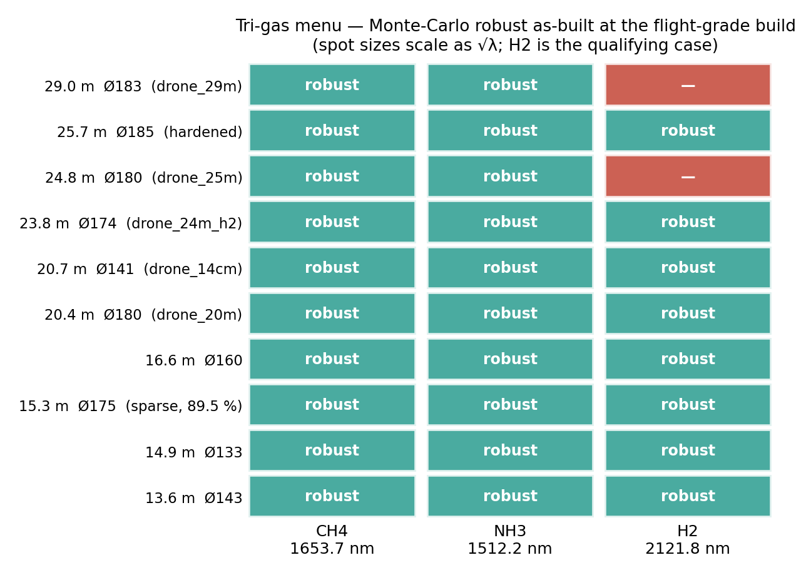
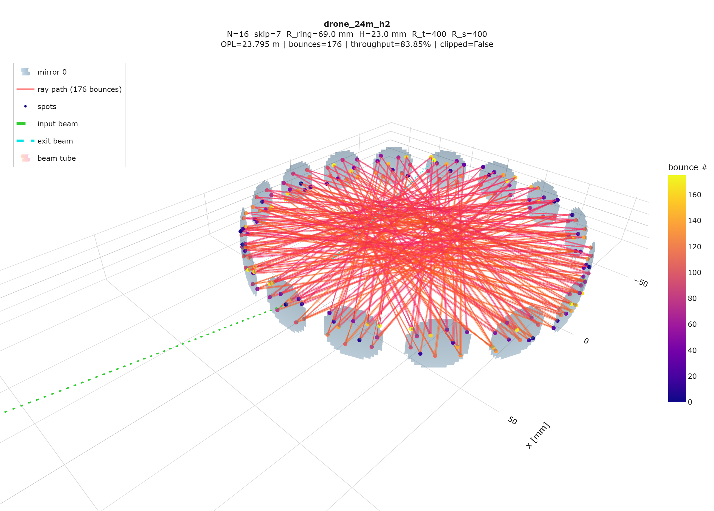

# Tri-gas operation: CH₄ 1653.7 nm, NH₃ 1512.2 nm, H₂ 2121.8 nm

*(Dr. Benoy, 2026-07-08: "Also do for hydrogen at 2121.8 nm. At the
opposite end of the spectrum you can do ammonia at 1512.2 nm. These are
the three interesting gases.")*

## 1. Why the same cells work at all three wavelengths

The re-entrance closure, chord geometry, OPL, throughput and spot
*positions* are pure ray geometry — wavelength-independent. The cavity
eigen-q obeys q = (Aq+B)/(Cq+D) whose solution fixes the Rayleigh range
z_R from the ABCD matrix alone, so every Gaussian spot radius scales as
√λ with unchanged waist locations. Re-qualifying a design at a new line
therefore means: scale the launch waist by √(λ/1654 nm) (a collimator
focus-ring turn), re-run the full check matrix, and re-run the build
Monte-Carlo — which is what `multigas_verify.py` does
([multigas_2121.8nm.csv](multigas_2121.8nm.csv),
[multigas_1512.2nm.csv](multigas_1512.2nm.csv)).

* NH₃ 1512.2 nm: spots **shrink** 4.4 % — every margin grows.
* H₂ 2121.8 nm: spots **grow** 13.3 % — separation, hole clearance and
  hole exit all tighten; this is the qualifying case.

## 2. The tri-gas menu (100-trial Monte-Carlo, as-built, no realignment)

  

**Flight-grade build (0.1 mrad class — the drone build):**

| design | envelope | OPL | T @0.999 | CH₄ 1654 | NH₃ 1512 | H₂ 2122 |
|---|---|---|---|---|---|---|
| drone_29m | Ø183 | 28.99 m | 76.6 % | ✅ | ✅ | ✖ (sep+exit margin) |
| **25.7 m hardened** (walk-budget 0.8 search) | Ø185 | **25.72 m** | 83.9 % | ✅ | ✅ | **✅ — new tri-gas OPL ceiling** |
| drone_25m | Ø180 | 24.77 m | 83.9 % | ✅ | ✅ | ✖ (sep margin) |
| **H₂-optimised 24m** | **Ø174** | **23.83 m** | 83.9 % | ✅* | ✅* | **✅** |
| drone_20m | Ø180 | 20.38 m | 86.7 % | ✅ (also research-grade) | ✅ | **✅** |
| drone_14cm | **Ø141** | 20.66 m | 81.6 % | ✅ | ✅ | **✅** |
| 16.6 m balanced | Ø160 | 16.60 m | 86.8 % | ✅ | ✅ | **✅** |
| **15.3 m sparse** (7 spots/mirror) | Ø175 | 15.30 m | **89.5 %** | ✅ | ✅ | **✅** |
| 14.9 m small | Ø133 | 14.85 m | 82.8 % | ✅ | ✅ | **✅** |
| 13.6 m max-T | Ø143 | 13.64 m | 87.7 % | ✅ | ✅ | **✅** |

*(The hardened 25.7 m and sparse 15.3 m rows were re-verified at both
gas lines with the same √λ-scaled Monte-Carlo:
[multigas_hardened_2121.8nm.csv](multigas_hardened_2121.8nm.csv),
[multigas_hardened_1512.2nm.csv](multigas_hardened_1512.2nm.csv) —
the walk-budget-0.8 margins absorb the +13.3 % H₂ spot growth, which is
exactly the "tolerance as a search input" mechanism working across
wavelength.)*

  

*The traced 176-chord path of the new H₂ design (`drone_24m_h2`),
Optiland-cross-validated at 2121.8 nm to 0.000 µm RMS; 400-trial
flight-grade Monte-Carlo: 176/176 bounces in every trial, zero clipping,
spot-walk p95 = 0.45 mm. Interactive:
[drone_24m_h2_experiment.html](figures/drone_24m_h2_experiment.html).*

*The new 23.83 m design (CM254-200-M01, N=16, skip 7, n=176, R_ring
69.014 mm) came from re-running the full search harness at 2121.8 nm; it
is the same mirror family as drone_25m on a 2.7 mm smaller ring, trading
0.9 m of path for H₂-robust margins (MC at 2122 nm: 100 % completion,
sep p05 = 1.02 mm, hole clearance p05 = 1.75 mm, walk p95 = 0.42 mm).
Feasibility at the shorter wavelengths follows a fortiori (smaller
spots); its 1654/1512 MC rows are in
[robust_menu_h2_flight.csv](robust_menu_h2_flight.csv).*

**Takeaways:** every design in the menu is a tri-gas cell for NH₃+CH₄;
six designs including both 20 m cells qualify for all three gases; the
H₂ ceiling is 23.8 m @ Ø174 instead of 29.0 m @ Ø183 — the √λ spot
growth costs one menu rung at the long-wavelength end. A cell built for
H₂ margins runs the other two gases with margin to spare, so **one
hardware build serves all three gases** (swap laser + detector +
window coating; the gold mirrors cover 0.8–20 µm).

## 3. Line data and what 20 m actually detects

HITRAN2020 values (fetched via HAPI), 296 K, 1 atm air, base-e:

| gas | line | λ | S [cm/molec] | peak absorbance per ppm·m | LOD @ NEA 1e-4, 20.4 m | LOD @ NEA 1e-6 (WMS) |
|---|---|---|---|---|---|---|
| CH₄ | 2ν₃ **R(3) triplet** 6046.94–6046.96 cm⁻¹ | 1653.73 nm | 3.16×10⁻²¹ (sum) | 3.8×10⁻⁵ | **129 ppb** | 1.3 ppb |
| NH₃ | ν₁+ν₃ multiplet at 6612.73 cm⁻¹ | 1512.24 nm | 2.26×10⁻²¹ (5.5×10⁻²¹ blended) | 5.3×10⁻⁵ | **92 ppb** | 0.9 ppb |
| H₂ | (1-0) S(1) electric quadrupole 4712.9046 cm⁻¹ | 2121.83 nm | 3.19×10⁻²⁶ | 1.6–2.9×10⁻⁹ | **0.17–0.31 %v** | 17–31 ppm |

⚠ **Paper correction:** the 1653.73 nm CH₄ feature is the 2ν₃ **R(3)**
triplet; "R(4)" (used in some of our earlier text and much of the
literature) is the *1651.0 nm* line. Fix before the next draft.

Reading the H₂ row correctly (and honestly): the quadrupole line is
~10⁵ weaker than the others — every H₂ TDLAS sensor in the literature
fights this. The best published direct-absorption result is 12 ppmv at
1 s over an 11.4 m cell at NEA ≈ 3×10⁻⁷ (Westberg et al., Opt. Express
33, 11409, 2025); WMS at NEA 2×10⁻⁶ gave 0.1 %v·m (Avetisov et al.,
Sensors 19, 5313, 2019). With 20.4–23.8 m and a 10⁻⁴ fringe-limited
floor the TMPC delivers 0.15–0.3 %v — and since H₂ safety reporting is
in % of the 4 %v LEL, 0.2 %v = 5 % LEL is already an operationally
useful leak alarm; pushing to tens of ppm needs WMS + the fringe floor
at 10⁻⁶, which is exactly what the enforced spot-separation margin and
wedged windows are for. The H₂ line is also sub-Doppler at 1 atm
(Dicke-narrowed to HWHM ≈ 0.013–0.02 cm⁻¹; γ_self = 0.0024 cm⁻¹/atm):
fit with Rautian/Galatry profiles, not Voigt, and beware etalons whose
FSR matches the narrow line — chord-scale OPDs (tens of cm), which the
spot-separation rule suppresses, matter more than window etalons.

## 4. Per-gas hardware chain

| item | CH₄ 1653.7 nm | NH₃ 1512.2 nm | H₂ 2121.8 nm |
|---|---|---|---|
| DFB laser | Eblana EP1654-DM (TO-39/butterfly, 3–10 mW); Norcada 1654 | Eblana EP1512-DM (10 mW, butterfly/DX1); Norcada 1512 | Nanoplus 2122 nm (~5 mW, flight-proven in lit.); LD-PD PL-DFB-2122 butterfly (4–7 mW). Eblana/Norcada: custom inquiry only |
| detector | standard InGaAs (0.9–1.7 µm, nA dark) | standard InGaAs | **extended InGaAs** (Thorlabs FD05D Ø0.5 mm, ~1 µA dark, or Hamamatsu G12183 series; µA-class dark → use small area + TEC) |
| window (wedged, AR, Ø1/2″) | WW10530-C (UVFS) or WW30530-D (sapphire) | WW10530-C (UVFS) | WW30530-D (sapphire; UVFS OH band makes IR-grade FS/sapphire the safe choice) |
| mirrors + cell | unchanged protected gold (0.8–20 µm) — same cell for all three | ← | ← |

## 5. Files

* [multigas_2121.8nm.csv](multigas_2121.8nm.csv), [multigas_1512.2nm.csv](multigas_1512.2nm.csv) — re-verification of the 7-design menu (nominal check matrix + MC at both grades per λ)
* [robust_menu_h2_flight.csv](robust_menu_h2_flight.csv), [robust_menu_h2.csv](robust_menu_h2.csv) — H₂-native search results tiered at flight/research grade (source of the 23.83 m design)
* `search_drone20m.py` now takes `TMPC_WAVELENGTH_MM` env override; `multigas_verify.py` automates the re-qualification
