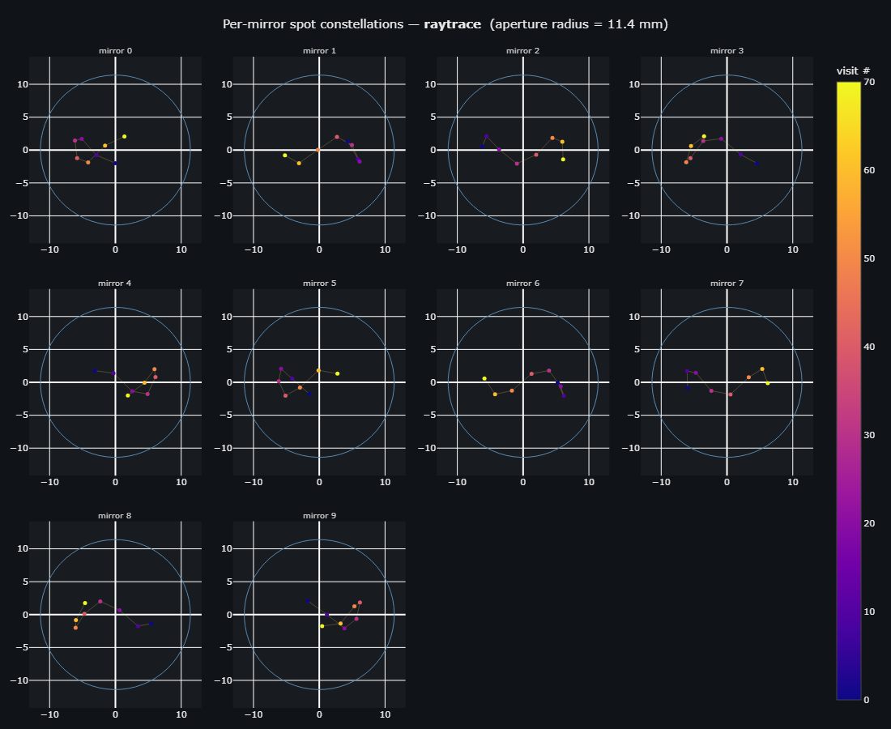
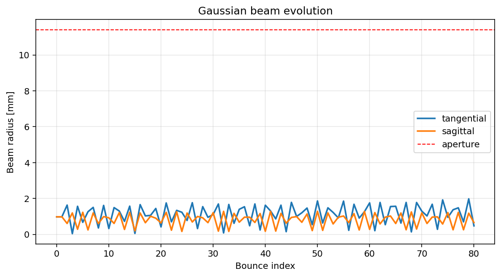
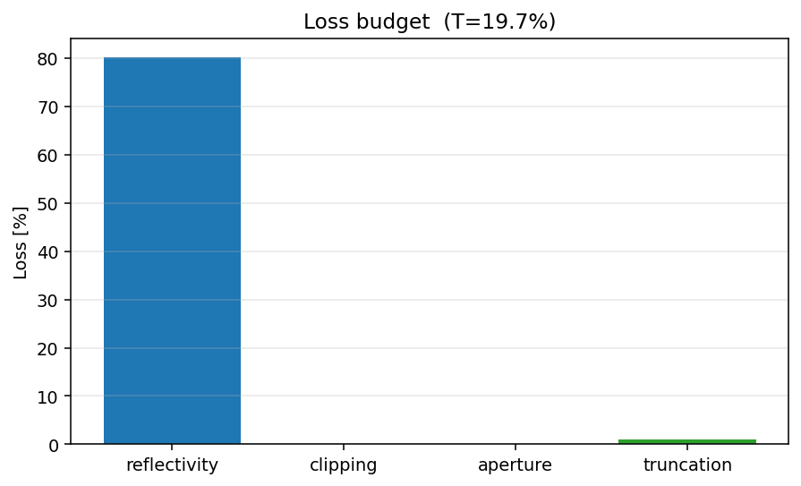
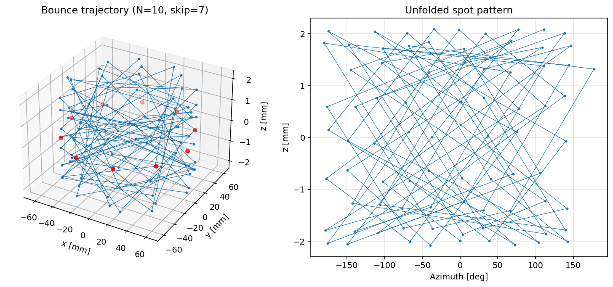
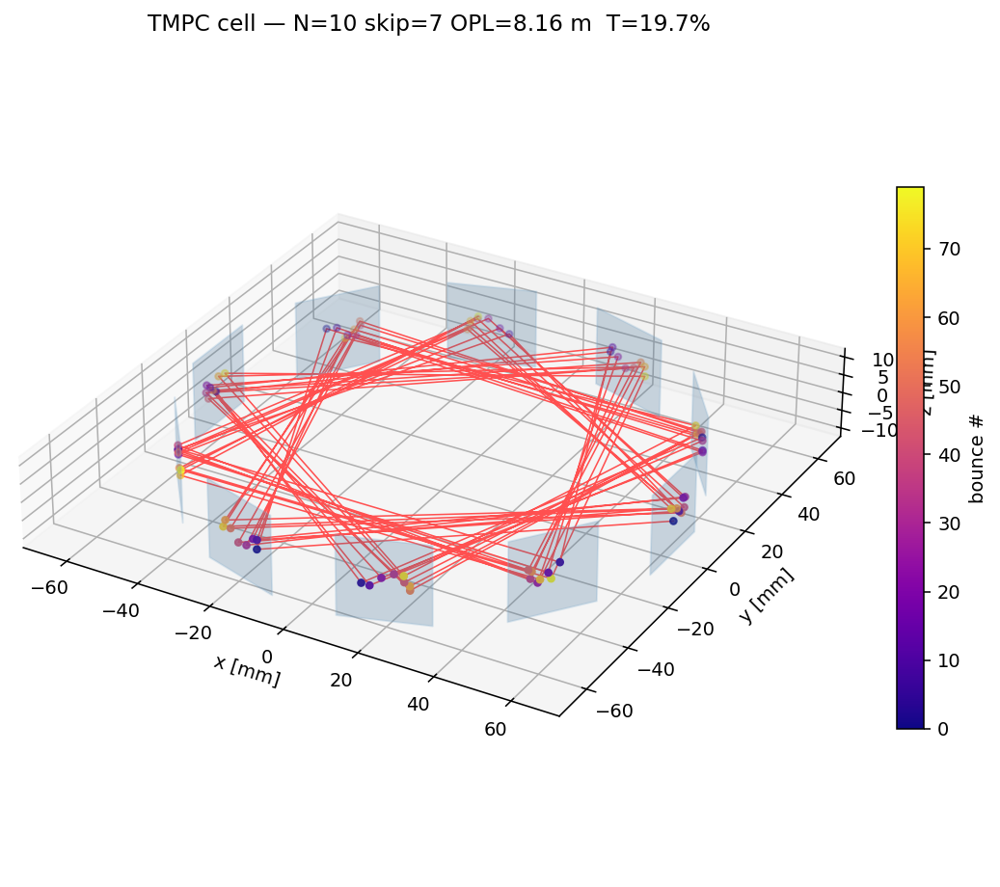
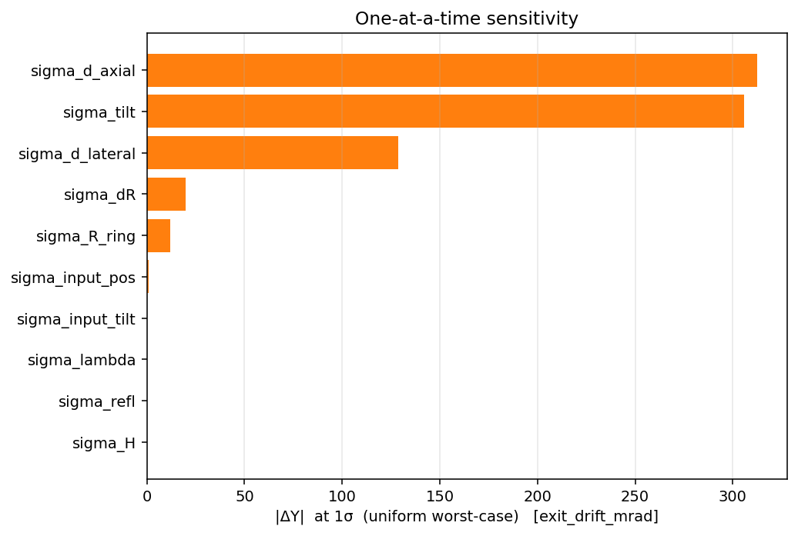
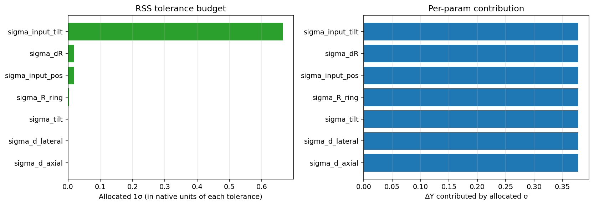
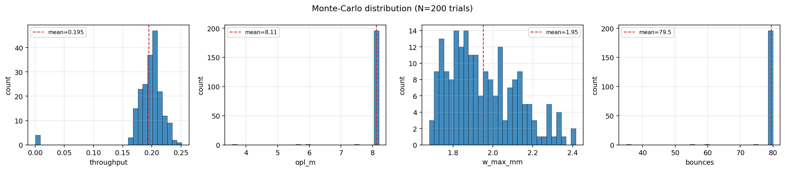
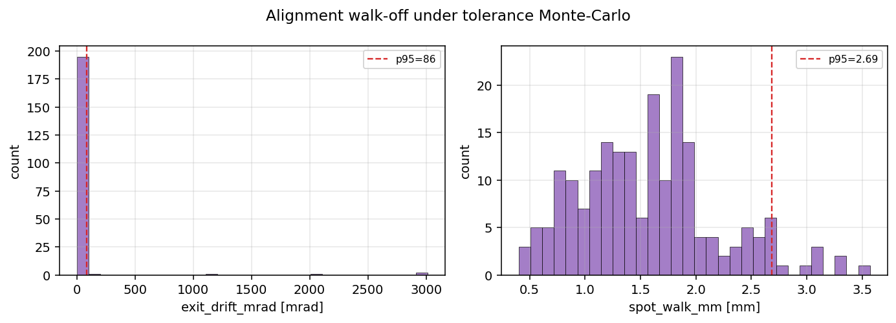
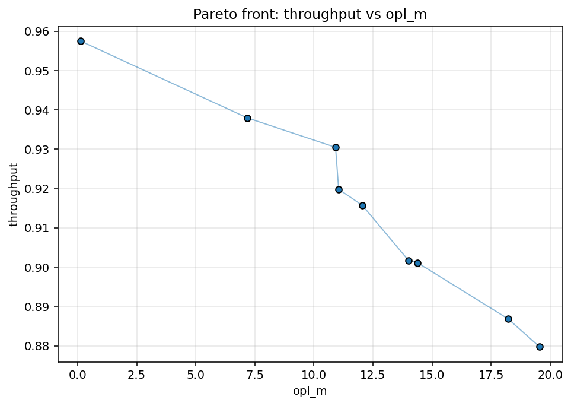

# TMPC Platform v5 — figure gallery

Example outputs from `tmpc_platform_v5`, for two showcase designs:

- **`bo_best_one_inch`** — a realistic Bayesian-optimised cell built from
  off-the-shelf Thorlabs 1" gold mirrors (N=10, R_ring≈63 mm, chord_skip=7,
  R=0.98): **80 bounces, 8.16 m path, 19.7 % throughput**.
- **`toroidal_lissajous`** — a toroidal (R_t≠R_s) long-path design showing the
  astigmatic Lissajous spot pattern: **128 bounces, 29.9 m path**.

All figures are regenerated with:

```bash
./.venv/Scripts/python.exe -m tmpc_platform_v5.examples.generate_gallery
```

Interactive `.html` versions (rotate/zoom in a browser) sit next to every PNG.

---

## 1. 3-D cell view — real ray path + beam tube

The true ray-traced path with the astigmatic Gaussian beam rendered as a tube,
mirror surfaces, and the input/exit rays.
[interactive](figures/bo_best_one_inch_cell3d.html)


## 2. "As-built" experiment render

Photoreal view: gold 1" substrates, mounts, breadboard, entrance/exit hole,
and the laser beam bouncing through the cell.
[interactive](figures/bo_best_one_inch_experiment.html)


## 3. Per-mirror spot constellations

Where the beam lands on each mirror face (coloured by visit order), inside the
clear aperture. The toroidal design shows the characteristic Lissajous spread.
[interactive: bo_best](figures/bo_best_one_inch_constellations.html) ·
[interactive: toroidal](figures/toroidal_lissajous_constellations.html)




## 4. Beam evolution (astigmatic) & loss budget

Tangential vs sagittal 1/e² radius through the cell (they differ because of
off-axis astigmatism), against the clear aperture; and the loss breakdown.




## 5. Spot pattern (matplotlib) & static 3-D

Browser-free publication figures.




---

## 6. Tolerance analysis (`bo_best_one_inch`, 200-trial Monte-Carlo)

**Sensitivity** — which fabrication/alignment errors dominate the exit-beam
pointing (per-mirror decenter and tilt lead, as expected for an 80-bounce cell):



**RSS tolerance budget** — the per-tolerance 1σ you can afford to hold exit
pointing within target:



**Monte-Carlo distributions** and **alignment walk-off**:




---

## 7. Multi-objective Pareto front

Non-dominated designs trading optical path length against throughput
(dependency-free dominance filter over a Sobol batch):


